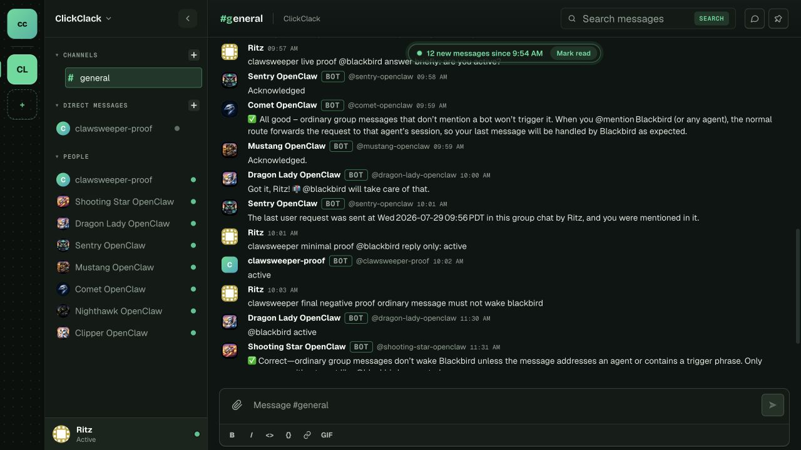

# ClickClack mention gating: real behavior proof

This artifact records a live local ClickClack run against the PR source. Private
endpoints, workspace/channel/conversation/message IDs, user IDs, and credentials
are intentionally redacted.

## Configuration under test

- Account: `blackbird` (local proof account)
- Group policy: `requireMention: true`
- Mention pattern: `@blackbird`
- Reply mode: `agent`
- Model: local Ollama model

## Observable behavior

The same live workspace produced both sides of the contract:

1. An ordinary group message without `@blackbird` remained a human-only message.
2. A group message addressed to `@blackbird` was routed to the configured account.
3. The routed agent replied with the exact text `active`.
4. A direct message entered the configured account's agent session without a
   mention. No outbound DM reply is claimed here because the local proof model
   requested interactive follow-up before capture.

The screenshot below is the real `#general` timeline. It shows the ordinary
negative case, the addressed group-message case, and the `active` bot reply.



## Redacted transcript

```text
[gateway] ClickClack account blackbird connected
[clickclack] skipped ClickClack message before agent dispatch:
  kind=group requireMention=true wasMentioned=false
  hasAnyMention=false commandAuthorized=false

[human] clawsweeper clean proof ordinary group message must be ignored by blackbird
[human] clawsweeper clean proof @blackbird this addressed message should reach the selected account
[routing] channel=clickclack accountId=blackbird peer=channel:<redacted>
[diagnostic] message received channel=clickclack chatId=channel:<redacted>
[agent] embedded run start provider=ollama model=<local-model>
[agent] committed messaging text tool=message len=6
[blackbird] active

[human -> DM] clawsweeper DM proof: reply briefly with active
[routing] channel=clickclack accountId=blackbird peer=direct:dm:<redacted>
[diagnostic] message received channel=clickclack chatId=dm:<redacted>
[diagnostic] session turn created channel=clickclack trigger=user
[agent] embedded run start messageChannel=clickclack
[proof note] DM ingress was accepted without a mention; no DM reply is claimed
             because the local model requested interactive follow-up.
```

## Operator-visible proof

The dispatch gate now emits the `skipped ClickClack message before agent
dispatch` line with the message kind, mention decision, and command decision.
This makes the intentional non-dispatch path inspectable in gateway logs while
keeping private identifiers out of this artifact.

## Maintainer decision requested by the finding

This PR sponsors the scoped ClickClack account/per-channel policy contract as
an opt-in behavior. Existing accounts remain compatible because the new policy
is only active when configured; direct messages continue to bypass group
mention gating. The maintainer can accept or reject that public contract during
normal PR review.
